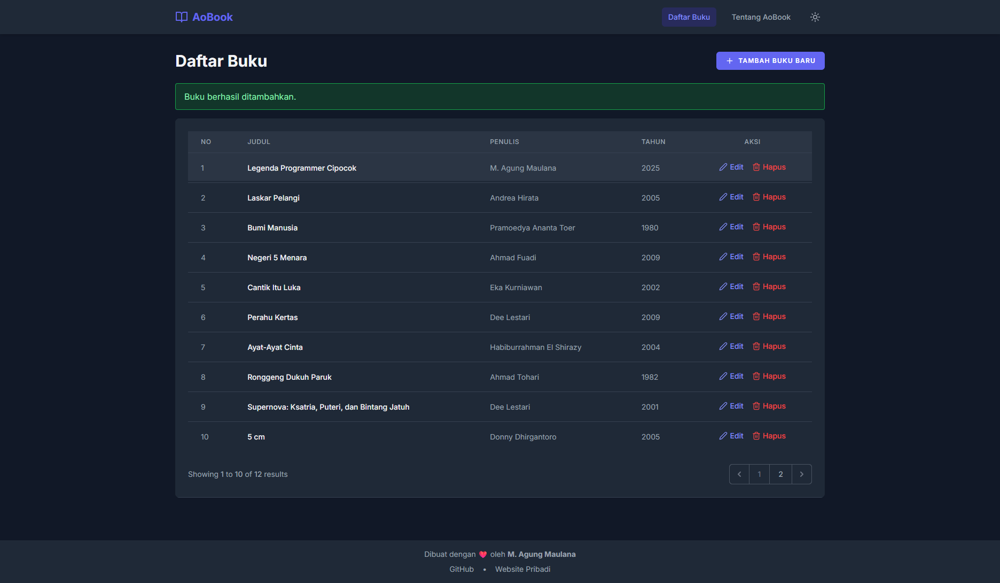
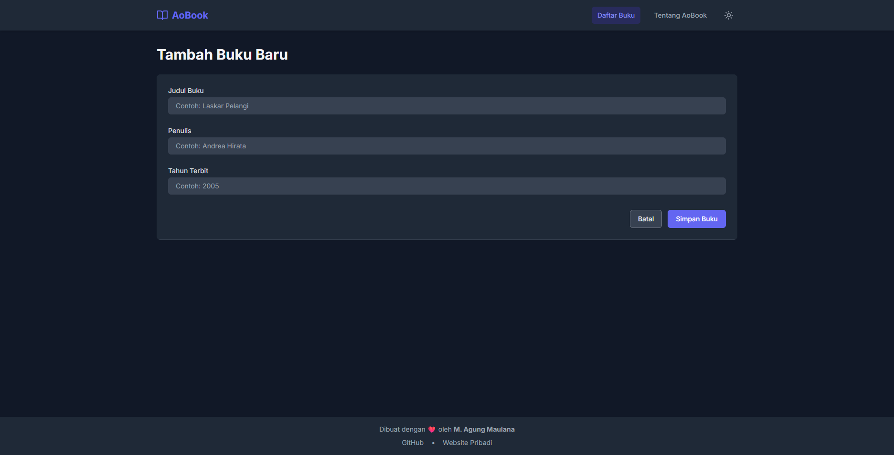
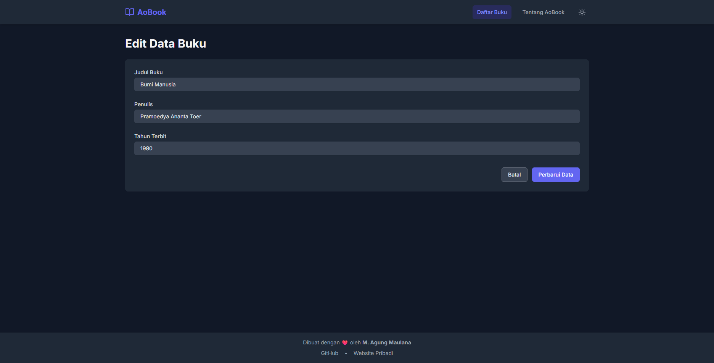

Berikut adalah versi yang telah di-_improve_ dari README Anda. Saya fokus pada bagian **langkah-langkah instalasi**, menjadikannya lebih ramah untuk pemula, dengan penjelasan tambahan dan format yang lebih rapi:

---

# 📚 AoBook - Aplikasi Manajemen Buku

**AoBook** adalah aplikasi web sederhana berbasis Laravel untuk mengelola koleksi buku pribadi. Anda bisa menambah, melihat, mengedit, dan menghapus data buku dengan antarmuka modern dan responsif.

---

## ✨ Fitur Utama

### 📘 1. Daftar Buku


Menampilkan seluruh koleksi buku dalam bentuk tabel. Dilengkapi fitur paginasi serta tombol **Edit** dan **Hapus** di setiap entri.

### ➕ 2. Tambah Buku Baru


Formulir sederhana dan intuitif dengan validasi input untuk menambah buku ke koleksi Anda.

### ✏️ 3. Edit Data Buku


Formulir edit otomatis terisi data lama, sehingga mudah untuk diperbarui dan disimpan kembali.

### ❌ 4. Hapus Buku

Setiap penghapusan menampilkan dialog konfirmasi untuk mencegah penghapusan yang tidak disengaja.

### ℹ️ 5. Halaman Tentang Kami

Menampilkan informasi tentang proyek ini serta profil singkat pengembang.

---

## 🛠️ Teknologi yang Digunakan

-   **Backend**: Laravel 12
-   **Frontend**: Blade + Tailwind CSS
-   **Database**: MySQL
-   **Icons**: Lucide Icons

---

## 🚀 Panduan Instalasi & Menjalankan Aplikasi

### 📋 Prasyarat

Sebelum memulai, pastikan Anda sudah menginstal:

-   PHP >= 8.2
-   [Composer](https://getcomposer.org/)
-   [Node.js & NPM](https://nodejs.org/)
-   MySQL atau database sejenis

---

### 🧩 Langkah-langkah Instalasi

Ikuti langkah-langkah di bawah ini untuk menjalankan AoBook di komputer lokal Anda.

#### 1. Clone Repository

```bash
git clone https://github.com/AgungSukaAFK/AoBook.git
cd AoBook
```

#### 2. Install Dependency PHP

Jalankan perintah berikut untuk menginstal semua dependency Laravel:

```bash
composer install
```

#### 3. Salin File Environment & Generate Key

```bash
cp .env.example .env
php artisan key:generate
```

> `.env` adalah file konfigurasi utama Laravel. Pastikan file ini ada sebelum menjalankan aplikasi.

#### 4. Konfigurasi Database

Edit file `.env` dan ubah bagian berikut sesuai konfigurasi database lokal Anda:

```env
DB_CONNECTION=mysql
DB_HOST=127.0.0.1
DB_PORT=3306
DB_DATABASE=aobook_db
DB_USERNAME=root
DB_PASSWORD=
```

> **Catatan:** Pastikan database `aobook_db` sudah dibuat di MySQL sebelum melanjutkan.

#### 5. Jalankan Migrasi dan (Opsional) Seeding

##### Untuk membuat tabel dan mengisi data awal:

```bash
php artisan migrate:fresh --seed
```

##### Jika hanya ingin membuat struktur tabel saja:

```bash
php artisan migrate
```

#### 6. Jalankan Aplikasi

Jalankan server lokal Laravel:

```bash
php artisan serve
```

Buka browser Anda dan akses aplikasi di:

```
http://127.0.0.1:8000
```

🎉 Aplikasi AoBook siap digunakan!

---

## 👨‍💻 Pengembang

-   **Nama**: M. Agung Maulana
-   **GitHub**: [@AgungSukaAFK](https://github.com/AgungSukaAFK)
-   **Website**: [aogung.com](https://aogung.com)

---

Jika Anda ingin, saya juga bisa bantu membuatkan badge README (misalnya Laravel version, license, GitHub stars) atau menambahkan instruksi deployment ke hosting seperti Railway, Vercel, atau Shared Hosting.
